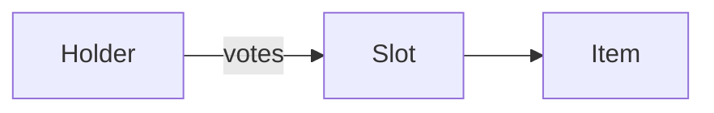

# Slots and items

## Slots

A token has up to four slots, each with bounds fixed at launch.

## Items

An item is a template plus parameters, owned by whoever holds its token.

Back to [the start](../index.md).
