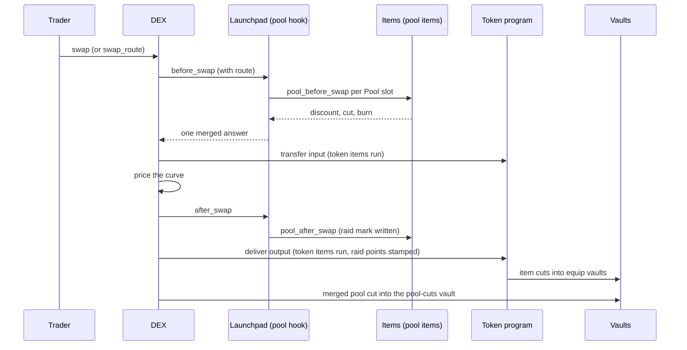

# How a trade runs

A buy on a units launch pool passes through the DEX, the launchpad's own rules, the token's pool items and the token's token items. Money an item takes lands in a vault and is paid out later by a permissionless step called **settle**.

## Two sides of an item

| Side | Called by | Sees | Can answer |
| --- | --- | --- | --- |
| Token side | The token program, on every transfer, mint and burn | Owners, balances, supply, who signed, its own holder bytes | One cut, a refusal, new holder bytes |
| Pool side | The launchpad, on every swap of the launch pool | Direction, amounts, reserves, the full route, the trader | A discount on the launch's fees, a cut in SOL, a burn |

Some templates have both halves, for example Raid: the pool half sees the route and writes a raid mark, and the token half stamps raid points into the buyer's holding on delivery.

## A buy, step by step

## Where the money goes

1. **Token-side cut**: each cutting item takes at most one cut per transfer, into its slot's **equip vault**.
2. **Pool-side cut**: all pool item cuts on one side merge into a single cut, in SOL, into the token's **pool-cuts vault**. Each item records its own share.
3. **Settle**: anyone can call `settle_equip`. It pays, in order: the item owner's **royalty**, a small bounty to whoever called settle, then each module's destination (burn, war chest, treaty partner, or a collector).
4. **Claim**: the item's current owner claims royalties at any time.

Traders never pay extra for royalties. A royalty is a share of what the item already took.

## Protocol fees

On launch pools the protocol keeps the inherited fee model: it earns a share of what the launch's rules and hooks collect on each swap, plus the launch pool's LP fee, in SOL. A launch whose rules collect nothing pays the protocol nothing beyond the LP fee. A season winner receives a share of protocol fees for the next season (see [War](war.md)).

## Discounts never touch the protocol

Raid and other discounts come out of the token's own creator and holder fees, capped at them. No item can lower the protocol's fee.

## Routes

`swap_route` runs up to `MAX_ROUTE_HOPS` hops (build value 3) in one instruction. Each hop's input is exactly what the previous hop delivered. The DEX fills the route itself, so a trader cannot forge where a buy came from.
